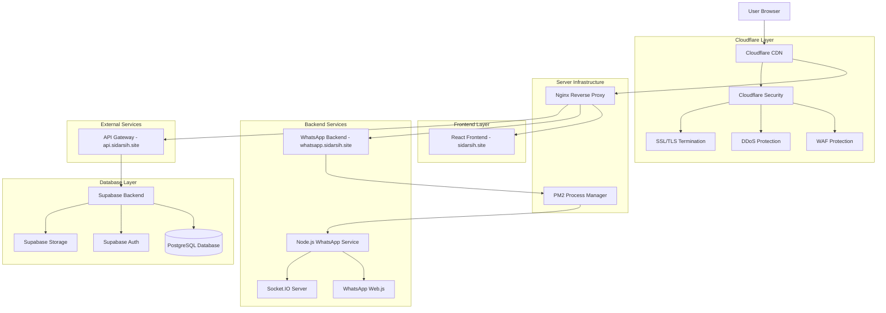
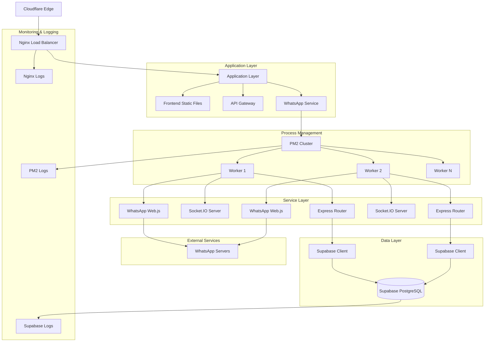
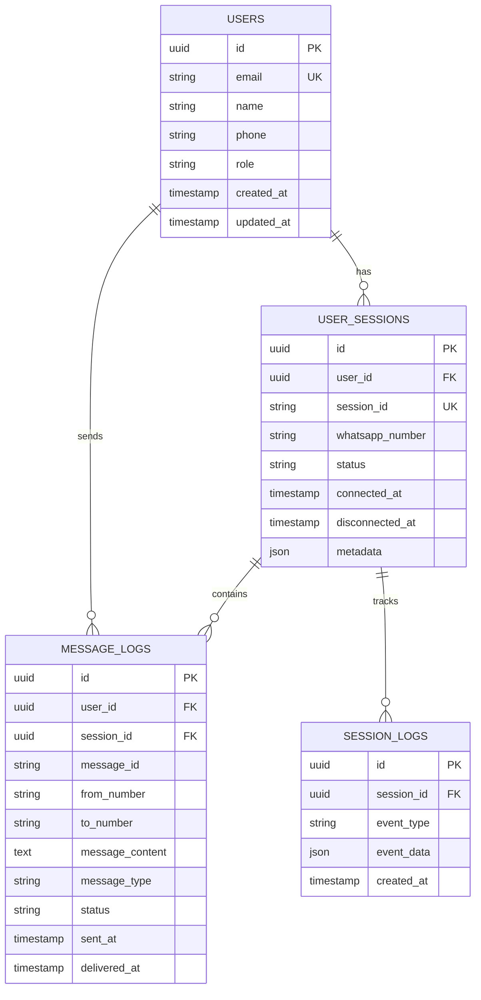

# Arsitektur Teknis Produksi dengan Cloudflare - SIDARSIH

## 1. Architecture Design



## 2. Technology Description

**Frontend:**
- React@18 + TypeScript
- Vite (build tool)
- TailwindCSS@3 (styling)
- Socket.IO Client (real-time communication)

**Backend:**
- Node.js@18 + Express@4
- WhatsApp Web.js (WhatsApp integration)
- Socket.IO Server (WebSocket communication)
- PM2 (process management)

**Infrastructure:**
- Nginx (reverse proxy & load balancer)
- Cloudflare (CDN, security, performance)
- Ubuntu Server (hosting)

**Database & Services:**
- Supabase (PostgreSQL + Auth + Storage)
- Redis (optional caching)

**Security & Performance:**
- Cloudflare WAF
- SSL/TLS Full (Strict)
- DDoS Protection
- Origin Certificates

## 3. Route Definitions

| Route | Purpose | Backend Service |
|-------|---------|----------------|
| https://sidarsih.site/ | Homepage aplikasi SIDARSIH | React Frontend |
| https://sidarsih.site/whatsapp-mobile | Interface WhatsApp mobile | React Frontend |
| https://sidarsih.site/admin | Panel admin (jika ada) | React Frontend |
| https://whatsapp.sidarsih.site/api/whatsapp/* | WhatsApp API endpoints | Node.js Backend |
| https://whatsapp.sidarsih.site/socket.io/* | WebSocket connections | Socket.IO Server |
| https://api.sidarsih.site/* | General API endpoints | Supabase |
| https://api.sidarsih.site/auth/* | Authentication endpoints | Supabase Auth |

## 4. API Definitions

### 4.1 WhatsApp Backend API

**Base URL:** `https://whatsapp.sidarsih.site/api/whatsapp`

#### Authentication & Session Management

```typescript
// Get QR Code for WhatsApp connection
GET /qr-code
```

Response:
| Param Name | Param Type | Description |
|------------|------------|-------------|
| qrCode | string | Base64 encoded QR code image |
| status | string | Connection status (loading/ready/authenticated) |
| sessionId | string | Unique session identifier |

Example:
```json
{
  "qrCode": "data:image/png;base64,iVBORw0KGgoAAAANSUhEUgAA...",
  "status": "ready",
  "sessionId": "session_123456"
}
```

```typescript
// Clear WhatsApp session
POST /clear-session
```

Request:
| Param Name | Param Type | isRequired | Description |
|------------|------------|------------|-------------|
| sessionId | string | true | Session ID to clear |

Response:
| Param Name | Param Type | Description |
|------------|------------|-------------|
| success | boolean | Operation success status |
| message | string | Status message |

#### Message Operations

```typescript
// Send WhatsApp message
POST /send-message
```

Request:
| Param Name | Param Type | isRequired | Description |
|------------|------------|------------|-------------|
| to | string | true | Phone number (format: 628xxxxxxxxx) |
| message | string | true | Message content |
| type | string | false | Message type (text/image/document) |

Response:
| Param Name | Param Type | Description |
|------------|------------|-------------|
| success | boolean | Send status |
| messageId | string | WhatsApp message ID |
| timestamp | number | Send timestamp |

### 4.2 Socket.IO Events

**Connection URL:** `https://whatsapp.sidarsih.site`

#### Client → Server Events

```typescript
// Join session room
emit('join-session', { sessionId: string })

// Request QR code refresh
emit('refresh-qr')

// Send message
emit('send-message', {
  to: string,
  message: string,
  type?: string
})
```

#### Server → Client Events

```typescript
// QR code updated
on('qr-updated', {
  qrCode: string,
  sessionId: string
})

// Connection status changed
on('status-changed', {
  status: 'loading' | 'ready' | 'authenticated' | 'disconnected',
  phoneNumber?: string
})

// Message received
on('message-received', {
  from: string,
  message: string,
  timestamp: number,
  messageId: string
})

// Message sent confirmation
on('message-sent', {
  messageId: string,
  status: 'sent' | 'delivered' | 'read' | 'failed'
})
```

### 4.3 Supabase API Integration

**Base URL:** `https://api.sidarsih.site`

#### Authentication

```typescript
// User registration
POST /auth/v1/signup
```

Request:
| Param Name | Param Type | isRequired | Description |
|------------|------------|------------|-------------|
| email | string | true | User email |
| password | string | true | User password |
| data | object | false | Additional user metadata |

#### Database Operations

```typescript
// Get user sessions
GET /rest/v1/user_sessions?user_id=eq.{userId}

// Create session log
POST /rest/v1/session_logs
```

## 5. Server Architecture Diagram



## 6. Data Model

### 6.1 Data Model Definition



### 6.2 Data Definition Language

#### Users Table
```sql
-- Create users table
CREATE TABLE users (
    id UUID PRIMARY KEY DEFAULT gen_random_uuid(),
    email VARCHAR(255) UNIQUE NOT NULL,
    name VARCHAR(100) NOT NULL,
    phone VARCHAR(20),
    role VARCHAR(20) DEFAULT 'user' CHECK (role IN ('user', 'admin', 'operator')),
    created_at TIMESTAMP WITH TIME ZONE DEFAULT NOW(),
    updated_at TIMESTAMP WITH TIME ZONE DEFAULT NOW()
);

-- Enable RLS (Row Level Security)
ALTER TABLE users ENABLE ROW LEVEL SECURITY;

-- Create policies
CREATE POLICY "Users can view own profile" ON users
    FOR SELECT USING (auth.uid() = id);

CREATE POLICY "Users can update own profile" ON users
    FOR UPDATE USING (auth.uid() = id);

-- Create indexes
CREATE INDEX idx_users_email ON users(email);
CREATE INDEX idx_users_phone ON users(phone);
```

#### User Sessions Table
```sql
-- Create user_sessions table
CREATE TABLE user_sessions (
    id UUID PRIMARY KEY DEFAULT gen_random_uuid(),
    user_id UUID REFERENCES users(id) ON DELETE CASCADE,
    session_id VARCHAR(100) UNIQUE NOT NULL,
    whatsapp_number VARCHAR(20),
    status VARCHAR(20) DEFAULT 'disconnected' CHECK (status IN ('connecting', 'ready', 'authenticated', 'disconnected')),
    connected_at TIMESTAMP WITH TIME ZONE,
    disconnected_at TIMESTAMP WITH TIME ZONE,
    metadata JSONB DEFAULT '{}',
    created_at TIMESTAMP WITH TIME ZONE DEFAULT NOW(),
    updated_at TIMESTAMP WITH TIME ZONE DEFAULT NOW()
);

-- Enable RLS
ALTER TABLE user_sessions ENABLE ROW LEVEL SECURITY;

-- Create policies
CREATE POLICY "Users can view own sessions" ON user_sessions
    FOR SELECT USING (auth.uid() = user_id);

CREATE POLICY "Users can insert own sessions" ON user_sessions
    FOR INSERT WITH CHECK (auth.uid() = user_id);

CREATE POLICY "Users can update own sessions" ON user_sessions
    FOR UPDATE USING (auth.uid() = user_id);

-- Create indexes
CREATE INDEX idx_user_sessions_user_id ON user_sessions(user_id);
CREATE INDEX idx_user_sessions_session_id ON user_sessions(session_id);
CREATE INDEX idx_user_sessions_status ON user_sessions(status);
```

#### Message Logs Table
```sql
-- Create message_logs table
CREATE TABLE message_logs (
    id UUID PRIMARY KEY DEFAULT gen_random_uuid(),
    user_id UUID REFERENCES users(id) ON DELETE CASCADE,
    session_id UUID REFERENCES user_sessions(id) ON DELETE CASCADE,
    message_id VARCHAR(100),
    from_number VARCHAR(20) NOT NULL,
    to_number VARCHAR(20) NOT NULL,
    message_content TEXT NOT NULL,
    message_type VARCHAR(20) DEFAULT 'text' CHECK (message_type IN ('text', 'image', 'document', 'audio', 'video')),
    status VARCHAR(20) DEFAULT 'sent' CHECK (status IN ('sent', 'delivered', 'read', 'failed')),
    sent_at TIMESTAMP WITH TIME ZONE DEFAULT NOW(),
    delivered_at TIMESTAMP WITH TIME ZONE,
    created_at TIMESTAMP WITH TIME ZONE DEFAULT NOW()
);

-- Enable RLS
ALTER TABLE message_logs ENABLE ROW LEVEL SECURITY;

-- Create policies
CREATE POLICY "Users can view own messages" ON message_logs
    FOR SELECT USING (auth.uid() = user_id);

CREATE POLICY "Users can insert own messages" ON message_logs
    FOR INSERT WITH CHECK (auth.uid() = user_id);

-- Create indexes
CREATE INDEX idx_message_logs_user_id ON message_logs(user_id);
CREATE INDEX idx_message_logs_session_id ON message_logs(session_id);
CREATE INDEX idx_message_logs_sent_at ON message_logs(sent_at DESC);
CREATE INDEX idx_message_logs_from_number ON message_logs(from_number);
CREATE INDEX idx_message_logs_to_number ON message_logs(to_number);
```

#### Session Logs Table
```sql
-- Create session_logs table
CREATE TABLE session_logs (
    id UUID PRIMARY KEY DEFAULT gen_random_uuid(),
    session_id UUID REFERENCES user_sessions(id) ON DELETE CASCADE,
    event_type VARCHAR(50) NOT NULL,
    event_data JSONB DEFAULT '{}',
    created_at TIMESTAMP WITH TIME ZONE DEFAULT NOW()
);

-- Enable RLS
ALTER TABLE session_logs ENABLE ROW LEVEL SECURITY;

-- Create policy
CREATE POLICY "Users can view logs for own sessions" ON session_logs
    FOR SELECT USING (
        session_id IN (
            SELECT id FROM user_sessions WHERE user_id = auth.uid()
        )
    );

-- Create indexes
CREATE INDEX idx_session_logs_session_id ON session_logs(session_id);
CREATE INDEX idx_session_logs_event_type ON session_logs(event_type);
CREATE INDEX idx_session_logs_created_at ON session_logs(created_at DESC);
```

#### Grant Permissions
```sql
-- Grant permissions to authenticated users
GRANT SELECT, INSERT, UPDATE ON users TO authenticated;
GRANT SELECT, INSERT, UPDATE, DELETE ON user_sessions TO authenticated;
GRANT SELECT, INSERT, UPDATE ON message_logs TO authenticated;
GRANT SELECT, INSERT ON session_logs TO authenticated;

-- Grant basic read access to anon role for public endpoints
GRANT SELECT ON users TO anon;
```

#### Initial Data
```sql
-- Insert admin user (example)
INSERT INTO users (email, name, role) VALUES 
('admin@sidarsih.site', 'Administrator', 'admin');

-- Insert sample session types for reference
INSERT INTO session_logs (session_id, event_type, event_data) VALUES 
(gen_random_uuid(), 'session_created', '{"source": "web", "ip": "127.0.0.1"}'),
(gen_random_uuid(), 'qr_generated', '{"timestamp": "2024-01-01T00:00:00Z"}'),
(gen_random_uuid(), 'whatsapp_connected', '{"phone": "+628123456789"}');
```

## 7. Security Considerations

### 7.1 Cloudflare Security Features
- **WAF Rules**: Custom rules untuk blocking suspicious requests
- **Rate Limiting**: API rate limiting untuk mencegah abuse
- **DDoS Protection**: Automatic DDoS mitigation
- **Bot Management**: Intelligent bot detection

### 7.2 Application Security
- **HTTPS Everywhere**: Full SSL/TLS encryption
- **CORS Configuration**: Strict origin policies
- **Input Validation**: Server-side validation untuk semua input
- **Authentication**: Supabase Auth dengan JWT tokens

### 7.3 Data Protection
- **Row Level Security**: Database-level access control
- **Data Encryption**: Encrypted data at rest dan in transit
- **Audit Logging**: Comprehensive activity logging
- **Backup Strategy**: Regular automated backups

## 8. Performance Optimization

### 8.1 Cloudflare Optimizations
- **Caching Strategy**: Aggressive caching untuk static assets
- **Image Optimization**: Automatic WebP conversion
- **Minification**: CSS, JS, dan HTML minification
- **Compression**: Brotli compression

### 8.2 Application Optimizations
- **Code Splitting**: Dynamic imports untuk React components
- **Lazy Loading**: Lazy loading untuk images dan components
- **Bundle Optimization**: Tree shaking dan dead code elimination
- **Database Indexing**: Optimized database queries

### 8.3 Infrastructure Optimizations
- **PM2 Clustering**: Multi-process untuk high availability
- **Load Balancing**: Nginx load balancing
- **Connection Pooling**: Database connection pooling
- **Caching Layer**: Redis untuk session dan data caching

## 9. Monitoring & Alerting

### 9.1 Application Monitoring
- **PM2 Monitoring**: Process health dan resource usage
- **Custom Health Checks**: Application-specific health endpoints
- **Error Tracking**: Comprehensive error logging
- **Performance Metrics**: Response time dan throughput monitoring

### 9.2 Infrastructure Monitoring
- **Server Metrics**: CPU, memory, disk usage
- **Network Monitoring**: Bandwidth dan latency tracking
- **Database Monitoring**: Query performance dan connection health
- **Cloudflare Analytics**: Traffic patterns dan security events

### 9.3 Alerting System
- **Critical Alerts**: Immediate notification untuk critical issues
- **Performance Alerts**: Threshold-based performance alerts
- **Security Alerts**: Security incident notifications
- **Capacity Alerts**: Resource utilization warnings